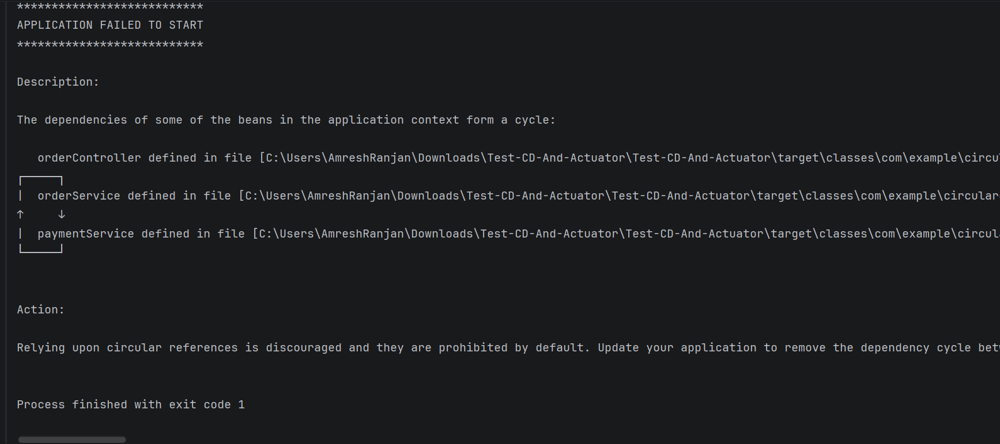
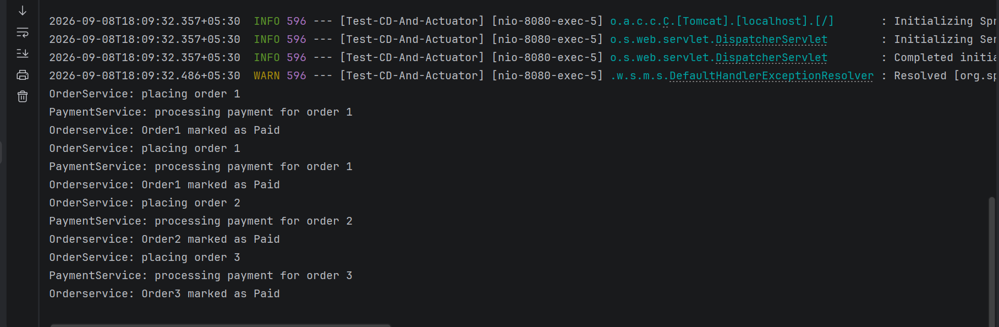
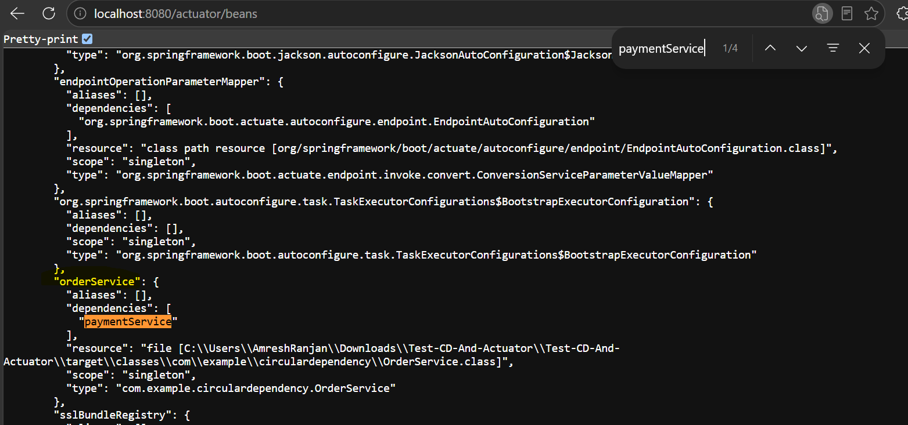
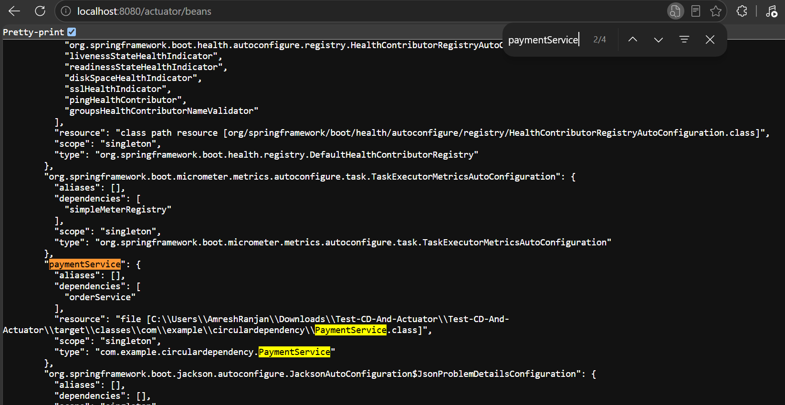
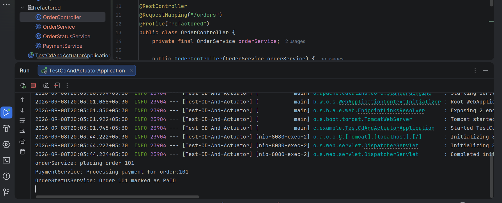
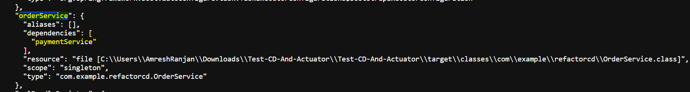
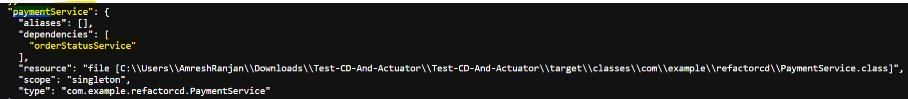

Circular Dependency During application startup:
-----------------------------------------------

Response After adding @Lazy to remove circular dependency

Beans details from Actuator UI:

Response After Refactoring code inorder to remove circular dependency:
(seprate orderStatus service for removing CD)

Now we can see in actuator UI OrderService depends on paymentService and paymentService depends on OrderStatusService, which gives idea CD has been resolved.

